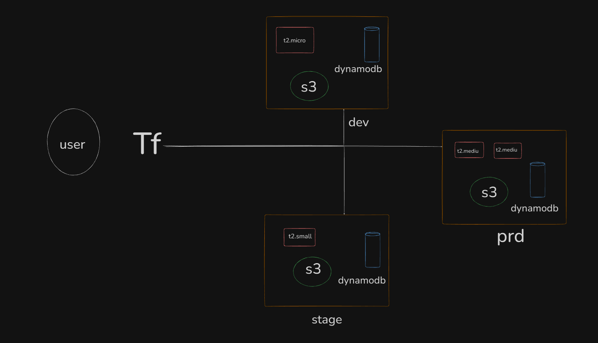

# Terraform Multi-Environment Architecture

## 📌 Overview
This diagram represents a **Terraform-based multi-environment infrastructure**, where a user triggers Terraform (Tf) to deploy resources into:

- **dev**
- **stage**
- **prd** (production)

Each environment contains AWS resources like **EC2**, **S3**, and **DynamoDB**, but with different configurations.

---

## 🧑‍💻 User
The user interacts with Terraform via:

- `terraform init`
- `terraform plan`
- `terraform apply`

Terraform then provisions resources into the selected environment.

---

# ⚙️ Terraform (Tf)

Terraform handles:

- Loading `.tf` configuration files  
- Maintaining infrastructure state (`terraform.tfstate`)  
- Using AWS providers  
- Applying environment-specific variables  
- Ensuring idempotent deployments across environments  

---

# 🌱 Environments

## **1. Dev Environment**
Includes:

- `t2.micro` EC2 instance  
- S3 bucket  
- DynamoDB table  

Purpose: development & testing.

---

## **2. Stage Environment**
Includes:

- `t2.small` EC2 instance  
- S3 bucket  
- DynamoDB table  

Purpose: QA & validation before production.

---

## **3. Production (prd) Environment**
Includes:

- Two `t2.medium` EC2 instances  
- S3 bucket  
- DynamoDB table  

Purpose: customer-facing high-performance environment.

---

